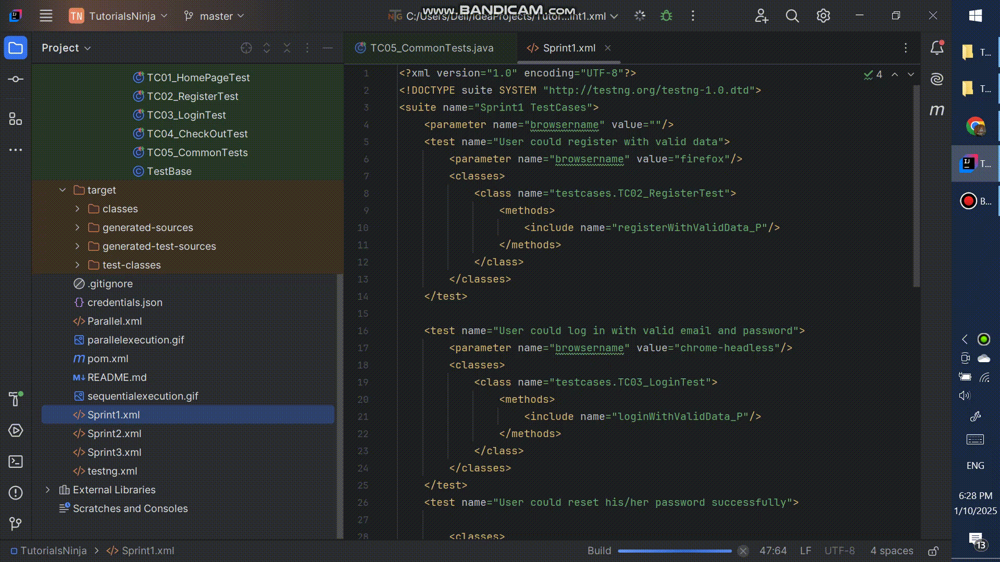

# TutorialNinja

## Table of Contents

- [Introduction](#introduction)
- [Features](#features)
- [Installation](#installation)
- [Usage](#usage)
- [Examples](#examples)
- [Contributing](#contributing)
- [License](#license)

## Introduction

**TutorialNinja** is a cutting-edge e-commerce platform crafted to revolutionize the online shopping
experience. It provides users with an intuitive interface, fast performance, and a rich feature set, making it the ideal choice for both customers and merchants.
This repository contains the source code, configuration files, and comprehensive documentation for setting up, customizing, and running the application.
## Examples

### Sequential testing execution example

### Parallel testing execution example

## Features

- **User Account Management**: Streamlined account creation, profile management, and order history tracking.
- **Product Purchasing**: Effortlessly shop for a wide range of products, including electronics, apparel, and more.
- **Dynamic Currency Switching**: Automatically adjust currency based on location or user selection.
- **Enhanced Search Functionality**:  Locate products quickly using filters like categories, brands, and price ranges.
- **Responsive Design**:Seamless and visually appealing experience across desktops, tablets, and smartphones.

## Installation

To set up the Tutorial Ninja application locally, follow these steps:

1. Clone the repository:

* git clone  

2. Navigate to the project directory:https://github.com/mfaroukacc/TutorialsNinja.git

* cd TutorialsNinja

3. Install dependencies:

* npm install

4. Configure the application:

* Update configuration files with necessary settings.

5. Run the application:

* npm start

## Usage

* User Guide: Refer to the User Guide for detailed information on how to use the TutorialsNinja application.

## Contributing

* We welcome contributions from the community. To contribute to TutorialsNinja, follow these steps:

## Fork the repository.

* Create a new branch for your feature or bug fix.
* Make your changes and submit a pull request.

## License

* TutorialsNinja is licensed under the MIT License.
  has context menu